# Lec01

## Preparation：xv6 chapter1

When a user program invokes a system call, the ==hardware== raises the privilege level and starts executing a pre-arranged function in the kernel.(硬件提升特权等级？ TSS的作用？)

 The fact that the shell is a ==user program==, and not part of the kernel.（shell就是一个普通用户进程）

### processes and memory

```C
//指针数组
char* ch[5];	//5个char*类型的数组，数组中存的是指针
//数组指针
char (*ch)[5]; 	//ch是一个指针，指向一个char [5]类型的数组
```

```c
//Most programs ignore the first element of the argument array,which is conventionally the name of the program
int main(int argc, char *argv[]){
    for(int i = 0; i < argc; ++ i){
        printf("argv[%d] is : %s\n", argc[i]);
    }
    return 0;
}
//编译	gcc test.c -o test
//执行	./test
//输出	argv[0] is ./test
```

### I/O and file descriptors

Two file descriptors share an offset if they were derived from the same original file descriptor by a sequence of fork and dup calls. Otherwise file descriptors do not share offsets, even if they resulted from open calls for the same file.（只有通过dup或者fork这类系统调用复制过来的文件描述符才会同时共享文件偏移）

==为什么fork()和exec()不写在一起？== IO重定向相关，下面说(如果写在一起，shell没什么机会对子进程进行IO重定向等操作)

#### IO重定向

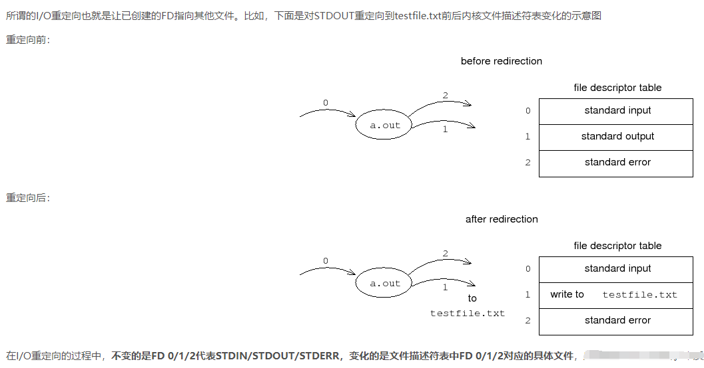

```shell
#cat < input.txt:
char *argv[2];
argv[0] = "cat";
argv[1] = 0;						#！！！这里的0不是之前想的代表文件描述符输入，是表示数组结尾的NULL
if(fork() == 0) {
	close(0);						#关闭0文件描述符
	open("input.txt", O_RDONLY);	#再打开文件input.txt时，就会被分配最小的可用文件描述符，就是0
	exec("cat", argv);				#执行cat命令，相当于cat 0，0代表之前打开的文件
}
###################################
g++ main.cpp 2>&1 | head			#2>&1 表示将stderr重定向到stdout
```

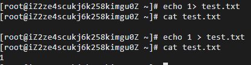

1后面有没有空格的区别，所以

```shell
echo test > file.txt		#相当于下面这条
echo test 1> file.txt

echo test 1>&2   			#相当于下面这条
echo test >&2

#0是控制台输入，1是控制台输出
```

### pipes

A pipe is ==a small kernel buffer== exposed to processes as a pair of file descriptors, one for reading and one for writing. 


```shell
echo hello world | wc
#也可以使用临时文件的形式来达到管道的作用
echo hello world >/tmp/xyz; wc </tmp/xyz
#临时文件的三个缺陷：
#（1）管道可以自动清理，临时文件需要用户自己清理
#（2）管道可以传输任意长度的数据流，而临时文件需要为传输数据先在硬盘上留出足够的空间
#（3）管道允许进程并行执行，而临时文件是顺序执行
```

==管道的实现方式是什么，为什么可以传输任意长度的数据流，没有大小限制？==如果是使用环形队列实现的话，怎么会没有长度限制呢？

==为什么使用p[2]来实现管道，而不是只使用一个文件描述符，一个进程连接stdin，另一个进程连接stdout？==管道在内核中使用环形队列机制实现，而且管道的使用必须是父子进程之间，也就是父进程先创建管道，然后fork子进程，父子进程之间共享这块缓冲区。使用两个文件描述符分别管理读和写更方便。==但是，我觉得使用一个文件描述符也可以实现，后续试试！==

### file system

One exception is cd, which is built into the shell. cd must change the current working directory of the shell itself. If cd were run as a regular command, then the shell would fork a child process, the child process would run cd, and cd would change the child ’s working directory. The parent’s working directory would not change.（cd被构建在shell中，因为cd需要改变当前shell的目录。如果cd是以一个普通命令的身份运行，它fork一个子进程，子进程该表工作目录，但是父进程的目录没有改变）

## 课程

操作系统目标：硬件抽象、多路复用、进程隔离、共享、安全、性能 

系统调用与普通函数调用的不同：内核是一段始终驻留的代码，具有特权，直接访问硬件之类

内核为每个进程维护单独的文件描述符，因此，两个进程中，相同的文件描述符可能指向的是不同的文件 

wait()系统调用避免出现僵尸进程，即父进程fork子进程之后，父进程调用wait()等待子进程退出。==但是，如果父进程fork了多个子进程，wait（）只会检测到其中任意一个子进程退出。如果想将子进程全部回收，可以多次调用wait（）,或者在一个循环中调用wait(),直到wait()的返回值是-1，返回值是-1有两种情况，一种是没有子进程了，一种是被中断了。如果是被中断了，就继续；如果是没有子进程了，就退出循环==

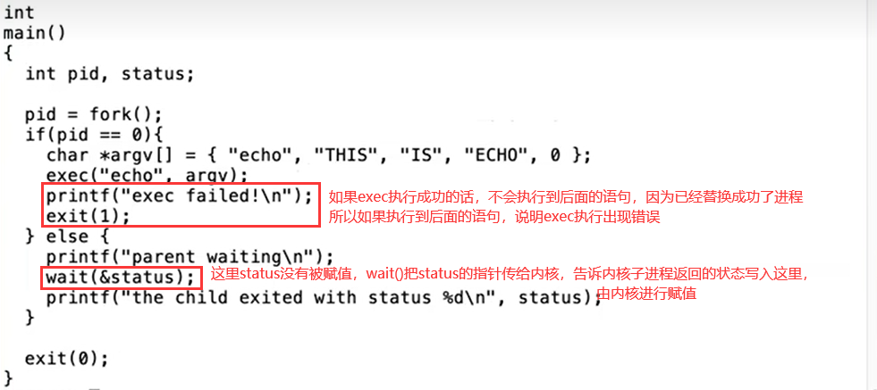

## Lab1

### Ubuntu下proxychains配置

#### 安装proxychains

```shell
sudo apt install proxychains	#安装proxychains,或者安装proxychains4也行
```

#### 查看主机v2ray中的端口并进行相关设置

查看自己主机上V2ray的端口号(==别看设置中的那个10808，看下面局域网socks的端口号，因为这个问题查了半天，结果是端口号写错了==)

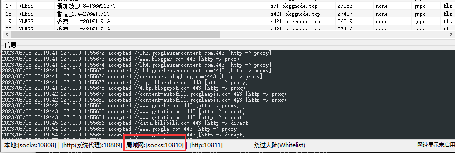

允许局域网连接

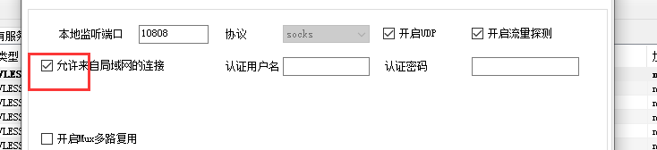

#### 设置虚拟机网络连接方式

虚拟机网络编辑器如下设置

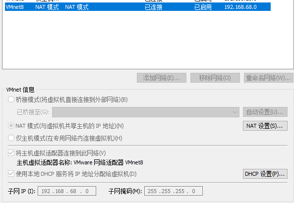

设置网络连接模式（==此处这个VMnet8可以简单地看作一个路由器，使用这种谅解方式相当于将主机与虚拟机连接到同一局域网中==）

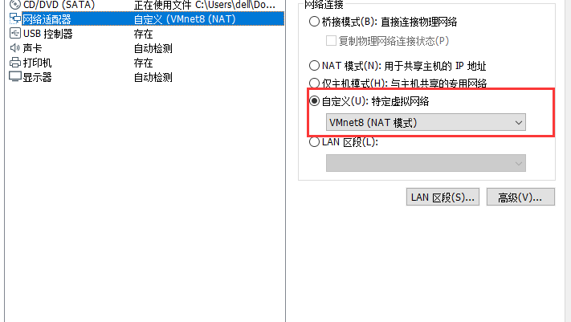

#### 配置虚拟机代理

在主机中使用ipconfig查看ip（==这里的ip使用的是VMnet8的ip==），然后再虚拟机中设置手动代理

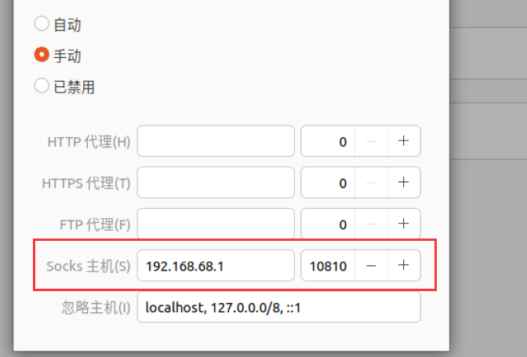

#### 在proxychains.conf中进行配置

```shell
sudo vi /etc/proxychains.conf	#打开/etc/proxychains.conf进行配置
```

注释掉proxy_dns

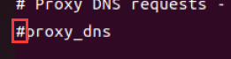

注释掉strict_chain并取消注释dynamic_chain

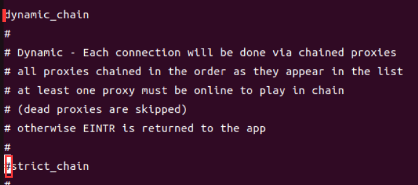

查看主机中的==局域网ip地址==，并在配置文件中添加ip地址和端口号

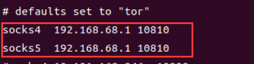

配置完成后只要在想要使用代理的命令前面加上proxychains即可


如果报错如下图：

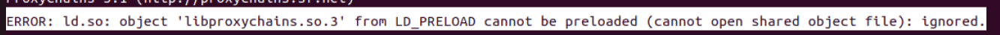

```shell
which proxychains						#先找到proxychains文件所在的位置
find /usr -name "libproxychains.so.3"	#接着寻找报错文件所在的位置
sudo vi /usr/bin/proxychains			#打开proxychains文件修改上面那个文件的位置，如下图所示
```

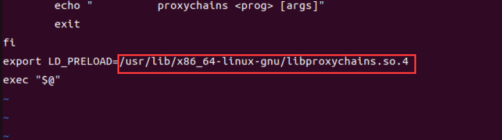

### 配置环境

在实验室电脑中的VMware Workstation中安装Ubuntu，下载的版本是Ubuntu 22.04.2 LTS

```shell
sudo apt install git			#安装git

cd /usr/local					#编译工具链安装到这个目录下（非必须）

git clone --recursive https://github.com/riscv/riscv-gnu-toolchain	#下载编译工具链
```

### 

